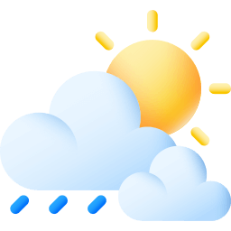
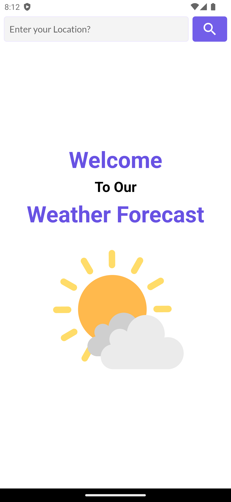
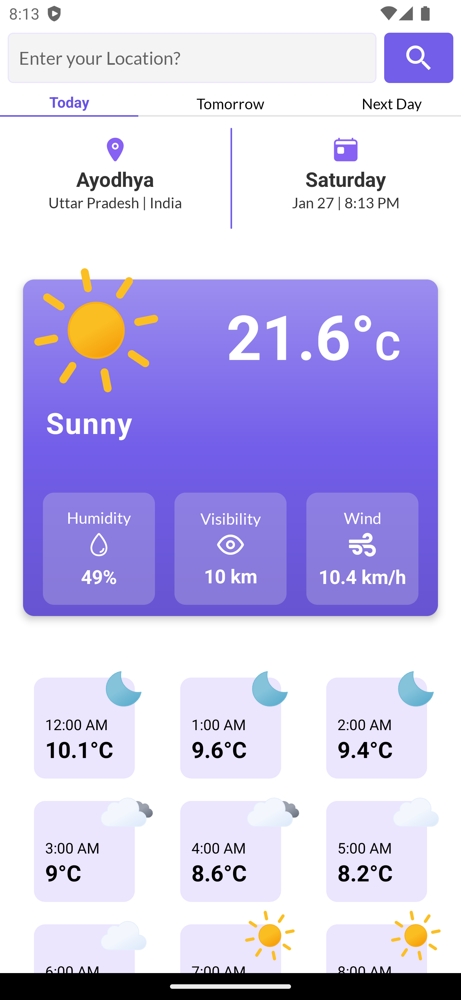
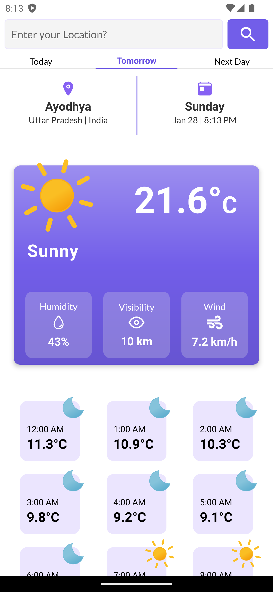
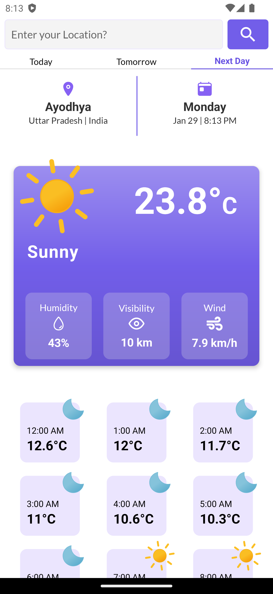
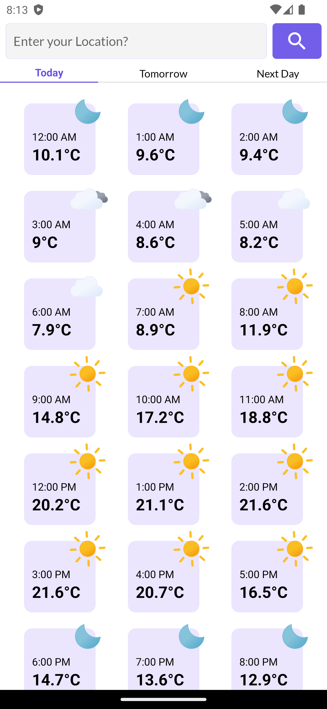

    
    <h1>Weather App</h1>
    
Harmony Weather : A Beautiful and Elevated Weather Experience

---

  
  
  

  
  

## 🎵 Features
- Current Weather Status 🌦️
- Today's Forecast ☀️🌧️🌬️
- Tomorrow's Forecast 📆
- Next Day Forecast 🔄
- 24-Hour Report ⏰📊
- Search Functionality 🔍🌍

## Download

## Disclaimer
This project and its contents are not affiliated with, funded, authorized, endorsed by, or in any way associated with YouTube, Google LLC or any of its affiliates and subsidiaries.

Any trademark, service mark, trade name, or other intellectual property rights used in this project are owned by the respective owners.
